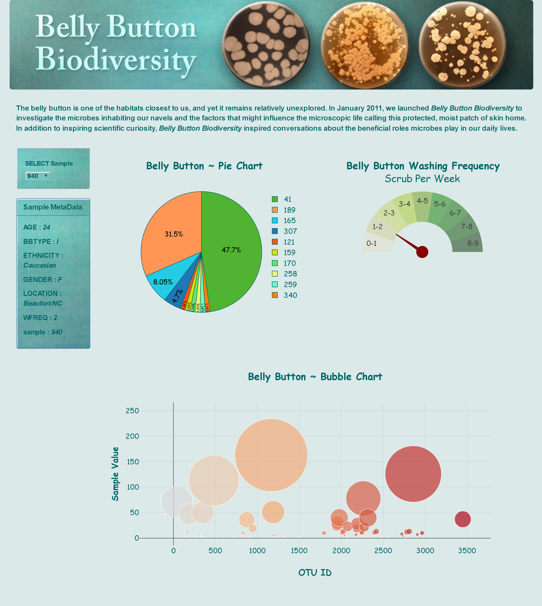

# Interactive-Visualizations-and-Dashboards-Challenge
The challenge is to build an interactive dashboard to explore the [Belly Button Biodiversity DataSet](http://robdunnlab.com/projects/belly-button-biodiversity/).

### <ins> Final Link for the Project (Deployed using Heroku) </ins>

https://sara-bellybuttondiversity.herokuapp.com/

### <ins> Final Look of the Website </ins>

